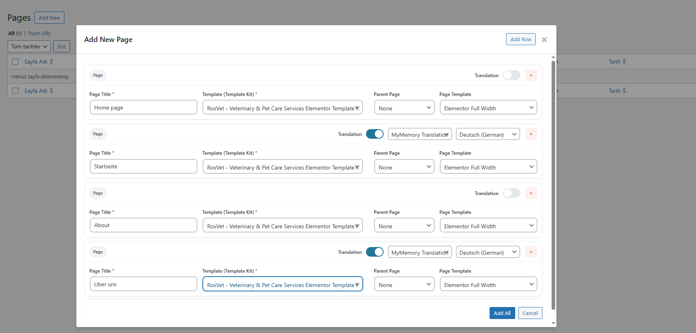

# Elementor Page Builder Assistant


Streamline your Elementor workflow by bulk importing template kits to pages and header/footer sections with built-in multi-language translation support.

## Overview

**Elementor Page Builder Assistant** is a powerful productivity tool designed for WordPress developers, designers, and agencies who work extensively with Elementor and Template Kits. This plugin dramatically reduces the time spent on repetitive tasks by enabling bulk operations and automatic content translation.

## Key Features

### Bulk Template Import
- Import multiple Elementor templates to pages in a single operation
- Add rows dynamically to create multiple pages at once
- Automatically apply template kits from your library
- Set page templates, parent pages, and other WordPress page attributes in bulk

### Header & Footer Management
- Import template kit sections as header, footer, or before-footer layouts
- Seamless integration with popular header/footer plugins
- Configure display rules and location targeting
- Support for Elementor Canvas template layouts

### 🔒 Built-in Translation Engine (PRO Feature)
- Translate imported templates on-the-fly during import **[PRO]**
- Support for multiple translation APIs: **[PRO]**
  - MyMemory Translation
  - LibreTranslate
  - DeepL
  - Microsoft Translator
  - Yandex Translate
- Translate to 70+ languages including English, Turkish, German, French, Spanish, Italian, Portuguese, Russian, Arabic, Chinese, Japanese, Korean, Hindi, and many more **[PRO]**
- Preserves Elementor structure while translating text content **[PRO]**
- Smart content detection for headings, paragraphs, buttons, and widgets **[PRO]**

> **Note:** Translation features are available in PRO version only.

### User-Friendly Interface
- Clean, intuitive admin interface integrated with WordPress
- Real-time import progress indicators
- Batch processing with visual feedback
- Filter and manage imported content easily

## Requirements

- WordPress 5.0 or higher
- Elementor (free version works, Pro recommended)
- Template Kit Import plugin (for importing templates from Envato Elements)
- PHP 7.0 or higher

## Installation

### From WordPress.org

1. Log in to your WordPress admin panel
2. Navigate to **Plugins > Add New**
3. Search for "Elementor Page Builder Assistant"
4. Click "Install Now" and then "Activate"

**Or install directly from WordPress.org:** [Elementor Page Builder Assistant](https://wordpress.org/plugins/elementor-page-builder-assistant/)

### Manual Installation

1. Download the plugin zip file from [Releases](https://github.com/bayramsavluk/elementor-page-builder-assistant/releases)
2. Navigate to **Plugins > Add New > Upload Plugin**
3. Choose the downloaded file and click "Install Now"
4. Activate the plugin through the Plugins menu

### Post-Installation Setup

1. Install and activate Elementor (if not already installed)
2. Install Template Kit Import plugin (for template kit functionality)
3. Go to **Elementor Import > Settings** to configure translation APIs (optional)
4. Import some template kits through Template Kit Import plugin
5. Start using the bulk import features from **Elementor Import** menu

## Usage

### Bulk Import Pages

1. Navigate to **Elementor Import > Pages**
2. Click "Add New Page"
3. Fill in page details and select a template from your library
4. Add multiple rows for batch import
5. Optionally enable translation and select target language
6. Click "Import" to process all pages

### Import Header & Footer

1. Navigate to **Elementor Import > Header & Footer**
2. Click "Add Header/Footer"
3. Select template section and layout type (header/footer/before footer)
4. Configure display rules (entire site, specific pages, etc.)
5. Enable translation if needed
6. Click "Import"

### Configure Translation APIs

1. Navigate to **Elementor Import > Settings**
2. Enable your preferred translation API
3. Enter API credentials if required
4. Save settings
5. Translation option will appear in import modals

## Translation API Setup

The plugin supports multiple translation providers:

| Provider | Free Tier | API Key Required | Quality |
|----------|-----------|------------------|---------|
| MyMemory | ✅ Yes (Limited) | ❌ No | Good |
| LibreTranslate | ✅ Yes (Self-hosted) | Depends | Good |
| DeepL | ❌ No | ✅ Yes | Excellent |
| Microsoft Translator | ❌ No | ✅ Yes | Excellent |
| Yandex Translate | ❌ No | ✅ Yes | Very Good |

## Who Is This For?

### Web Developers & Designers
- Quickly prototype client websites using template kits
- Create multilingual sites without manual translation work
- Streamline your development workflow

### Digital Agencies
- Scale your client onboarding process
- Deliver multilingual websites faster
- Reduce repetitive manual work

### Freelancers & Solopreneurs
- Take on more projects with less time investment
- Offer multilingual services without additional overhead
- Focus on creative work instead of repetitive tasks

### Template Kit Creators
- Test your templates across multiple pages quickly
- Demonstrate multilingual capabilities to clients
- Speed up quality assurance processes

## Supported Languages

**70+ Languages including:**
- **European:** English, Turkish, German, French, Spanish, Italian, Portuguese, Russian, Polish, Dutch, Swedish, Norwegian, Danish, Finnish, Greek, Czech, Romanian, Hungarian, Ukrainian, Bulgarian, Croatian, Slovak, Slovenian, Serbian
- **Asian:** Chinese, Japanese, Korean, Hindi, Bengali, Vietnamese, Thai, Indonesian, Malay, Tamil, Telugu, Marathi, Punjabi, Gujarati, Kannada, Malayalam, Sinhala, Khmer, Lao, Burmese
- **Middle Eastern:** Arabic, Persian, Hebrew, Urdu
- **Caucasian & Central Asian:** Georgian, Armenian, Azerbaijani, Kazakh, Uzbek
- **Baltic:** Estonian, Latvian, Lithuanian
- **Celtic:** Irish, Welsh
- **Other:** Albanian, Macedonian, Bosnian, Maltese, Basque, Catalan, Galician, Afrikaans, Swahili, Amharic, Nepali, Icelandic

And more languages are supported depending on your chosen translation API!

## Privacy & Data

- Translation is performed through third-party APIs - check your chosen provider's privacy policy
- No data is collected or stored by this plugin
- Template imports remain on your WordPress installation
- All operations are performed within your WordPress environment

## Frequently Asked Questions

**Does this plugin work without Elementor Pro?**  
Yes, the plugin works with the free version of Elementor. However, Elementor Pro unlocks additional features like theme builder and advanced widgets.

**Which template kits are supported?**  
Any template kit compatible with the Template Kit Import plugin will work, including template kits from Envato Elements.

**How does the translation feature work?**  
The plugin parses Elementor's JSON structure, identifies translatable text content, sends it to your configured translation API, and updates the template with translated text while preserving all design elements.

**Can I undo an import?**  
Yes, imported pages can be moved to trash or permanently deleted through the plugin's interface. The plugin marks imported content with metadata for easy identification.

**Does this plugin slow down my site?**  
No, the plugin only runs in the WordPress admin area and has no impact on your site's frontend performance.

## Contributing

We welcome contributions from the community! Here's how you can help:

1. Fork the repository
2. Create a feature branch (`git checkout -b feature/amazing-feature`)
3. Commit your changes (`git commit -m 'Add amazing feature'`)
4. Push to the branch (`git push origin feature/amazing-feature`)
5. Open a Pull Request

Please ensure your code follows WordPress coding standards and includes appropriate documentation.

## Support

For support requests, please:
- Check the [Documentation](https://github.com/bayramsavluk/elementor-page-builder-assistant/wiki)
- Search existing [Issues](https://github.com/bayramsavluk/elementor-page-builder-assistant/issues)
- Create a new issue if your problem hasn't been addressed

## Changelog

### Version 1.0.0 - 2025-11-24
- Initial release
- Bulk page import from template kits
- Header/Footer template import
- Multi-language translation support (70+ languages)
- Support for 5 translation APIs (MyMemory, LibreTranslate, DeepL, Microsoft, Yandex)
- Batch processing interface
- Display rules and location targeting
- WordPress 6.8 compatibility
- Elementor 3.20 compatibility

## Screenshots



### Plugin Interface

1. **Pages Management** - Bulk import interface with template selection
2. **Header & Footer Builder** - Import template sections with display rules
3. **Translation Settings** - Configure multiple translation APIs (PRO)
4. **Batch Processing** - Real-time import progress with visual feedback
5. **List Table View** - Manage imported content with WordPress-style interface

## License

This plugin is licensed under the GPL v2 or later.

```
Elementor Page Builder Assistant
Copyright (C) 2025 bayramsavluk

This program is free software; you can redistribute it and/or modify
it under the terms of the GNU General Public License as published by
the Free Software Foundation; either version 2 of the License, or
(at your option) any later version.

This program is distributed in the hope that it will be useful,
but WITHOUT ANY WARRANTY; without even the implied warranty of
MERCHANTABILITY or FITNESS FOR A PARTICULAR PURPOSE. See the
GNU General Public License for more details.
```

